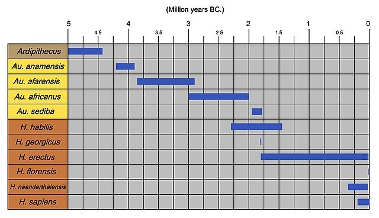

```{r setup, include=FALSE}
knitr::opts_chunk$set(echo = TRUE)
```

```{r cargar librerias y leer archivos csv, echo=FALSE, warning=FALSE, message=FALSE}
# Cargar librerías
library(readr)
library(dplyr)
library(ggplot2)
# Lectura de archivos CSV
hominidos <- read_csv("Hominidos_DataSet.csv")
evolution <- read_csv("Evolution_DataSets.csv")
```

*Nota: Este informe fue generado el `r format(Sys.Date(), "%d de %B de %Y")` mediante código reproducible.*

# Introducción

El estudio de la [**evolución humana**]{style="color:#CC79A7"} busca entender cómo los [*ancestros humanos*]{style="color:#6A5ACD"} (homínidos) han cambiado a lo largo del tiempo. Los registros fósiles muestran variaciones en características biológicas como el tamaño del cráneo (capacidad craneal), la estatura, la forma de la mandíbula y la locomoción bípeda. Por ejemplo, se estima que *Homo sapiens* tiene una capacidad craneal de alrededor de 1350 cm^3^, muy superior a la de especies más antiguas como *Australopithecus africanus*. Además, cambios climáticos (como niveles de CO~2~ y expansiones de sabanas) pudieron influir en la dispersión de los homínidos fuera de África.

**En este proyecto analizamos** un conjunto de datos biológicos de homínidos[^1] con el objetivo de explorar tendencias evolutivas y realizar un análisis estadístico.

[^1]: Datos provenientes de Kaggle: *"Biological Data of Human Ancestors Data Sets"* (Santiago, 2022).

> "Este dataset se centra en homínidos consensuados."



*Figura 1:* *Cronograma evolutivo* *de distintos géneros de homínidos. (Fuente: Conty, 2010, Wikimedia Commons, CC BY 3.0)*

# Preparación de datos

Los **datos utilizados en este trabajo provienen del conjunto Biological Data Of Human Evolution Data Sets** disponible en Kaggle [@evolution_kaggle].

Para visualizar los datos en nuestro trabajo, utilizaremos [@R-base], [@R-knitr] y [@R-dplyr]. En lo que respecta a la creación de gráficas, haremos uso de [@R-ggplot2].

Para el análisis, se proporcionaron dos archivos CSV con información biológica de distintas especies de homínidos: `Hominidos_DataSet.csv` y `Evolution_DataSets.csv`. Ambos contienen información similar, aunque presentan diferencias relevantes: el dataset `Hominidos_DataSet.csv`[@kaggle_hominidos] codifica categorías mediante valores numéricos; por otro lado, `Evolution_DataSets.csv`[@evolution_kaggle] incluye etiquetas descriptivas. **En este trabajo utilizaremos** principalmente `Evolution_DataSets.csv` por su legibilidad, gracias a la facilidad que aporta para la interpretación directa de las variables.

A continuación, se muestra una previsualización de la tabla objeto de estudio:

```{r Previsualización_evolución, echo=FALSE}
PRE_Evo <- evolution %>% 
  select(`Genus_&_Specie`, Time, Location)
knitr::kable(head(PRE_Evo, 10), align = 'c', caption= "Tabla 1. Previsualización de datos de Evolution_DataSets.csv ") #Estamos filtrando los primeros datos de una tabla que hemos generado para previsualizar lo datos y ver con que dataset nos quedamos
```

Como resultado, `evolution` contiene **`r nrow(evolution)` filas (observaciones)** y **`r ncol(evolution)` columnas (variables)**. Cada **fila** corresponde a una observación de una especie de homínido en un momento y contexto determinados; algunas de las **variables de interés** incluidas son:

-   **Genus\_&Specie**: Nombre del género y especie (e.g., *Homo sapiens*, *Australopithecus afarensis*).
-   **Time**: Antigüedad en millones de años de la especie.
-   **Cranial_Capacity**: Capacidad craneal en centímetros cúbicos (cm³), indicador del tamaño del cerebro.
-   **Height**: Estatura estimada en centímetros.
-   **Habitat**: Tipo de hábitat predominante (bosque, sabana, etc.).
-   **Diet**: Dieta predominante (frugívora, omnívora, etc.).
-   **Migrated**: Indica si hay evidencia de migración fuera de África (valores `"yes"` o `"no"`).

Como ejemplo descriptivo inicial, la capacidad craneal promedio de todos los registros es aproximadamente `r round(mean(evolution$Cranial_Capacity, na.rm=TRUE), 1)` cm³. Asimismo, observamos que las especies más recientes (menor valor de Time) tienden a presentar capacidades craneales mayores, y *Homo sapiens* es la única especie actual incluida en el dataset.

# Visualización y Análisis de datos

## Estaditica descriptiva
Para realizar un analisis estadistico fiable, tenemos que tener en cuenta la naturaleza de los datos analizados, por ello, debemos asumir que los datos siguen una distribución normal, no existe colinealidad entre las variables independietes, hay homogeneidad de varianza y las muestras son independientes. Estas asunciones con base en el gran volumen de datos de los que disponemos

## Relación entre migración y tamaño craneal

Como objetivo principal de nuestro trabajo, encontramos comparar las diferentes capacidades craneales que presentan tanto las especies que han sufrido un proceso de migración desde el continente africano como las que no. Para ello, haremos uso de varias hipótesis propuestas con el fin de estudiar si aquellos homínidos que migraron, con todo lo que esta migración conlleva, vieron como fruto un aumento en la capacidad craneal.

Primero, para explorar la relación entre la migración de la especie y el tamaño del cráneo, planteamos la siguiente **hipótesis Primaria**:

-   **Hipótesis nula (H0)**: Las especies que migraron fuera de África no difieren en su capacidad craneal promedio de las especies que no migraron.

-   **Hipótesis alternativa (H1)**: Las especies que migraron fuera de África tienen una capacidad craneal promedio distinta (mayor) a la de las especies que no migraron.

Vamos a previsualizar a utilizar en nuestro análisis:

```{r CC_Migrated, echo=FALSE}
CC_Migrated <- evolution %>% 
  select(Cranial_Capacity, Migrated)
knitr::kable(head(CC_Migrated, 10), align = 'c', caption= "Tabla 2. Previsualización de datos de capacidad craneal frente a migración")
```

Antes de probar esta hipótesis, describimos las variables involucradas: **Migrated** es una variable categórica binaria ("yes"/"no") y **Cranial_Capacity** es una variable numérica continua (medida en cm³). Dado que comparamos las medias de dos grupos independientes, emplearemos una prueba t de Student para dos muestras independientes.

A continuación, calculamos las medias muestrales de capacidad craneal por grupo de migración y aplicamos la prueba t:

```{r cranial_means, echo=FALSE, warning=FALSE, message=FALSE}
# Calcular estadísticos descriptivos por grupo (Migrated = yes/no)
mean_by_group <- evolution %>%
  group_by(Migrated) %>%
  summarize(N = n(),
            Media = mean(Cranial_Capacity, na.rm=TRUE),
            Desv = sd(Cranial_Capacity, na.rm=TRUE))
knitr::kable(mean_by_group, digits = 2, 
             caption = "Tabla 3. Estadísticos descriptivos de capacidad craneal según migración")
```

Hemos utilizado el siguiente chunk para generar la tabla:

```{verbatim}
r mean_by_group <- evolution %>%
  group_by(Migrated) %>%
  summarize(N = n(),
            Media = mean(Cranial_Capacity, na.rm=TRUE),
            Desv = sd(Cranial_Capacity, na.rm=TRUE))
knitr::kable(mean_by_group, digits = 2, 
             caption = "Capacidad craneal media (cm³) por grupo de migración")
```

Como se vislumbra en la tabla anterior, la media de capacidad craneal de los homínidos **migrantes** es mayor que la de los **no migrantes**. Podemos observarlo también en esta figura:

```{r, echo=FALSE, message=FALSE, fig.align="center"}
ggplot(evolution, aes(x = Migrated, y = Cranial_Capacity)) +
  geom_boxplot(fill = "orange", color = "purple", alpha = 0.7) +
  labs(
    title = "Medias de la capacidad craneal según su migración",
    x = "Migración",
    y = "Capacidad craneal (cm³)"
  ) +
  theme_minimal(base_size = 12) +
  theme(
    plot.title = element_text(face = "bold", hjust = 0.5, color = "midnightblue")
  )
```

*Figura 2: Medias de la capacidad craneal según la migración fuera de África. El diagrama de cajas muestra diferencias claras en la capacidad craneal en función de si las especies migraron o no fuera de África. Las especies migrantes presentan, en términos generales, valores medios y medianos de capacidad craneal más elevados, así como una mayor concentración en rangos altos, mientras que las especies no migrantes muestran capacidades craneales sensiblemente inferiores y una mayor dispersión hacia valores bajos.*

Para elaborar este gráfico hemos realizado lo siguiente:

```{verbatim}
r 
ggplot(evolution, aes(x = Migrated, y = Cranial_Capacity)) +
  geom_boxplot(fill = "orange", color = "purple", alpha = 0.7) + #Estamos usando el boxplot con intención de comparar las medias
  labs(
    title = "Medias Capacidad Craneal según su migración",
    x = "Migración",
    y = "Capacidad Craneal (cm³)"
  )
```

Ahora, realizamos la prueba estadística:

```{r ttest, echo=FALSE, warning=FALSE, message=FALSE}
# Prueba t de Student para Cranial_Capacity entre grupos Migrated
resultado_t <- t.test(Cranial_Capacity ~ Migrated, data = evolution)
resultado_t
```

El resultado de la prueba t indica un **p-valor** muy pequeño (p \< 0.001). Con un nivel de significación α = 0.05, **rechazamos la hipótesis nula**. En otras palabras, existe evidencia estadística de que la capacidad craneal promedio difiere entre homínidos migrantes y no migrantes. De hecho, la media de los migrantes es significativamente mayor, lo que sugiere que los homínidos con cerebros más grandes tuvieron mayor probabilidad de dispersarse fuera de África.

## Relación entre altura y migración

Con el fin de profundizar en nuestra hipótesis que relaciona capacidad craneal y migración, dado que correlación entre variables no implica causalidad entre estas, vemos pertinente respaldarla con dos hipótesis secundarias.

En la primera de estas hipótesis, el procedimiento consistirá en responder a la pregunta de si la altura en efecto está relacionada positivamente con la migración, ya que un aumento de la altura conlleva a un aumento de la capacidad. Pero en primer lugar, necesitamos comprobar que exista esa relación positiva entre altura y capacidad craneal.

Se plantea la siguiente **hipótesis terciaria**:

-   **Hipótesis nula (H0)**: No existe relación entre capacidad craneal y tamaño corporal en las especies que migraron fuera de África.
-   **Hipótesis alternativa (H1)**: Existe una relación significativa entre capacidad craneal y tamaño corporal en las especies migrantes.

Primero, volvemos a hacer una previsualización de los datos que nos interesan:

```{r preview_terciary, echo=FALSE}
# Seleccionar variables para la segunda hipótesis
Height_Cranial <- evolution %>% 
  select(Height, Cranial_Capacity)

knitr::kable(head(Height_Cranial, 10),
             align= "c",
             caption = "Tabla 4. Previsualización de datos de capacidad craneal frente a altura")
```

Procedemos a trabajar con los datos de altura:

```{r descriptivos_secondary, echo=FALSE}
desc_secondary <- evolution %>%
  summarize(
    N = n(),
    Media_Height = mean(Height, na.rm = TRUE),
    SD_Height = sd(Height, na.rm = TRUE),
    Media_Cranial = mean(Cranial_Capacity, na.rm = TRUE),
    SD_Cranial = sd(Cranial_Capacity, na.rm = TRUE)
  )
knitr::kable(desc_secondary, digits = 2,
             caption = "Tabla 5. Estadísticos descriptivos de capacidad craneal según altura")
```

A continuación, mostramos un gráfico simple de la relación:

```{r scatter_secondary, echo=FALSE, message=FALSE, fig.align="center"}
library(ggplot2)

ggplot(evolution, aes(x = Height, y = Cranial_Capacity)) +
  geom_point(alpha = 0.5, color = "darkblue") +
  geom_smooth(method = "lm", se = TRUE, color = "red") +
  labs(
    title = "Relación entre tamaño corporal y capacidad craneal",
    x = "Height (cm)",
    y = "Cranial Capacity (cm³)"
  ) +
  theme_minimal(base_size = 12) +
  theme(
    plot.title = element_text(face = "bold", hjust = 0.5, color = "midnightblue")
  )

```

*Figura 3: Diagrama de dispersión del tamaño corporal (altura) frente a la capacidad craneal. Se observa una tendencia positiva: a mayor tamaño corporal, mayor capacidad craneal. La línea de regresión muestra esta relación creciente entre ambas variables, con una concentración de observaciones en valores intermedios de altura y capacidad craneal.*

Por último, se realizó la prueba estadística mediante una **correlación de Pearson**, ya que permite evaluar de forma adecuada la relación lineal entre dos variables cuantitativas continuas, como las dos con las que estamos trabajando.

```{r correlacion_height_cranial, echo=FALSE, warning=FALSE, message=FALSE}
# Prueba de correlación de Pearson entre Height y Cranial_Capacity
resultado_cor <- cor.test(evolution$Height, evolution$Cranial_Capacity)

resultado_cor
```

Los resultados obtenidos muestran que, en efecto, encontramos correlación positiva entre altura y capacidad craneal. Es por eso, que llegados a este punto, es adecuado comparar las variables de altura y migración, ya que hemos visto que un aumento en la altura lleva consigo un aumento en la capacidad craneal. Para ello, nos proponemos realizar la hipótesis secundaria antes mencionada.

Se plantea la siguiente **hipótesis secundaria**:

-   **Hipótesis nula (H0)**: No existe relación entre la altura y la migración de las especies de homínidos.
-   **Hipótesis alternativa (H1)**: Existe una relación significativa entre la altura y la migración de las especies de homínidos.

Procedemos a seleccionar los datos a utilizar:

```{r preview_secondary, echo=FALSE}
# Seleccionar variables para la segunda hipótesis
Height_migration <- evolution %>% 
  select(Height, Migrated)

knitr::kable(head(Height_migration, 10),
             align= "c",
             caption = "Tabla 5. Previsualización de datos de migración frente a altura")
```

Una vez contamos con los datos con los que queremos trabajar en esta hipótesis secundaria, procedemos a visualizarlos con el siguiente gráfico:

```{r plot_height_migration, echo=FALSE, fig.align="center"}
ggplot(evolution, aes(x = Migrated, y = Height)) +
  geom_boxplot(alpha = 0.7, fill = "steelblue") +
  labs(
    title = "Altura según migración",
    x = "Migración",
    y = "Altura (cm)"
  ) +
  theme_minimal()
```

*Figura 4: Gráfico Boxplot. Se muestra una tendencia a presentar mayor altura en aquellas especies de homínidos que hayan migrado.*

Por último, realizamos el análisis estadístico adecuado que nos permitirá ver si existe una correlación entre la altura y la migración:

```{r height_migration_ttest, echo=FALSE}
t.test(Height ~ Migrated, data = evolution)
```

Como podemos observar en los resultados, obtenemos un p-value extremadamente bajo (p-value \< 2.2e-16), por lo que afirmamos la existencia de la correlación, aunque insistimos en que no explica ni determina una causalidad. Concluimos, entonces, que se refuerza la idea previa de una relación entre capacidad craneal y migración.

## Relación entre dieta y migración

Los análisis previos nos mostraron que tanto la migración como el tamaño corporal guardan relación con la capacidad craneal de las distintas especies de homínidos del dataset, pero estos factores no actúan de forma aislada en la evolución del cerebro humano. Entre los elementos más influyentes en los procesos de encefalización se encuentra la dieta, muy relacionada a migración y tamaño corporal, pues esta varía dependiendo de la época y hábitat de los homínidos, esta dieta determina la disponibilidad energética necesaria para desarrollar tejidos costosos como el cerebro.

Es por eso oportuno usar la variable de dieta para hacer una segunda hipótesis secundaria que vuelva a reforzar nuestra hipótesis principal sobre la correlación entre la capacidad craneal y la migración. Para ello, es necesario por lo tanto realizar una segunda hipótesis terciaria que responda a la pregunta de si la dieta está primeramente relacionada con la capacidad craneal.

Planteamos la siguiente **hipótesis terciaria**:

-   **Hipótesis nula (H0)**: La capacidad craneal promedio no difiere entre los diferentes tipos de dieta presentes en el dataset (frugívora, omnívora, etc.).
-   **Hipótesis alternativa (H1)**: La capacidad craneal promedio sí difiere entre los distintos tipos de dieta; es decir, la dieta está asociada a variaciones en la capacidad craneal.

Realizamos primero la visualización de los datos a utilizar:

```{r preview_diet, echo=FALSE}
Diet_Cranial <- evolution %>% 
  select(Diet, Cranial_Capacity)

knitr::kable(
  head(Diet_Cranial, 10),
  align = "c",
  caption = "Tabla 6. Previsualización de datos de capacidad craneal frente a dieta"
)
```

Procedemos a trabajar con los datos de la dieta:

```{r descriptivos_diet, echo=FALSE}
desc_diet <- evolution %>%
  group_by(Diet) %>%
  summarize(
    n = n(),
    Media_Cranial = mean(Cranial_Capacity, na.rm = TRUE),
    SD_Cranial = sd(Cranial_Capacity, na.rm = TRUE)
  )

knitr::kable(desc_diet, digits = 2, 
             align = "c",
             caption = "Tabla 8. Estadísticos descriptivos de capacidad craneal según tipo de dieta")  
```

Visualizamos los datos usando un gráfico adecuado:

```{r plot_diet, echo=FALSE, message=FALSE, fig.align="center"}
ggplot(evolution, aes(x = Diet, y = Cranial_Capacity, fill = Diet)) +
  geom_boxplot(alpha = 0.7) +
  labs(
    title = "Capacidad craneal según tipo de dieta",
    x = "Tipo de dieta",
    y = "Capacidad craneal (cm³)"
  ) +
  theme_minimal(base_size = 12) +
  theme(
    plot.title = element_text(face = "bold", hjust = 0.5, color = "midnightblue")
  )
```

*Figura 5: Diagrama de cajas de la capacidad craneal según el tipo de dieta. Se observan diferencias en la distribución de la capacidad craneal entre los distintos grupos dietéticos. Las especies con dieta carnívora y omnívora presentan, en general, valores medianos más elevados, mientras que las dietas basadas en frutos secos y frutos blandos se asocian con capacidades craneales menores. La variabilidad también difiere entre grupos, siendo especialmente amplia en el caso de las especies omnívoras.*

Por último, hacémos un nuevo análisis estadístico que compare las variables de altura y capacidad craneal.

```{r anova_diet, echo=FALSE}
anova_res <- aov(Cranial_Capacity ~ Diet, data = evolution)
summary(anova_res)
```

Los análisis realizados indican que la dieta está asociada a diferencias significativas en la capacidad craneal (ANOVA: p \< 0.05). Las comparaciones post-hoc muestran que ciertas categorías dietéticas presentan capacidades craneales notablemente diferentes, lo que sugiere que los cambios alimentarios pudieron desempeñar un papel relevante en el proceso de encefalización en homínidos.

Este resultado es coherente con hipótesis paleoantropológicas clásicas que vinculan dietas más energéticas (incluyendo mayor acceso a carne o alimentos procesados) con el aumento del tamaño cerebral en el linaje humano. No obstante, la interpretación debe realizarse con cautela, ya que la dieta interactúa con múltiples factores ecológicos, tecnológicos y anatómicos.

Una vez confirmada la relación existente entre dieta y capacidad craneal, resulta pertinente analizar cómo la migración afecta a la dieta para reforzar nuestra hipótesis principal. Desde un enfoque estadístico, esto nos permite comprobar si los procesos migratorios se asocian con cambios significativos en el tipo de alimentación. En particular, podemos evaluar si, como consecuencia de la migración, se observa una mayor proporción de dietas energéticas en las poblaciones estudiadas. Esta evidencia contribuiría a sostener que la migración no solo implica desplazamiento geográfico, sino también adaptaciones alimentarias. En conjunto, este análisis añade coherencia y solidez a la hipótesis general del estudio.

Planteamos la siguiente **hipótesis secundaria**:

-   **Hipótesis nula (H0)**: No existe ninguna correlación entre dieta y migración.
-   **Hipótesis alternativa (H1)**: Existe una correlación entre la dieta y la migración.

Procedemos a visualizar los datos:

```{r plot_migration_diet, echo=FALSE, fig.align="center", message=FALSE}
ggplot(evolution, aes(x = Diet, fill = Migrated)) +
  geom_bar(position = "fill") +
  scale_y_continuous(labels = scales::percent) +
  labs(
    title = "Distribución del tipo de dieta según migración",
    x = "Tipo de dieta",
    y = "Proporción de especies",
    fill = "Migración"
  ) +
  theme_minimal()
```

*Figura 6: Gráfico de distribución del tipo de dieta según la migración de la especies de homínidos. Este gráfico muestra que aquellas especies que presentan una dieta de alto valor energético (carnívora y omnívora) cuentan con un mayor porcentaje de migración desde el continente africano.*

```{r table_migration_diet, echo=FALSE}
tabla_mig_diet <- table(evolution$Migrated, evolution$Diet)
tabla_mig_diet
```

Realizamos un análisis estadístico adecuado:

```{r chisq_migration_diet, echo=FALSE}
chisq.test(tabla_mig_diet)
```

Con los resultados obtenidos (p_value \< 2.2e-16), podemos concluir que efectivaemente existe una correlación entre la dieta de los homínidos y la migración de estos. Y habiendo determinado previamente que existe una relación entre la dieta y la capacidad craneal, nos sirve para de nuevo reforzar nuestra idea principal sobre conexión entre el aumento de la capacidad craneal y la migración de las especies de homínidos.

# Conclusiones

-   Las especies de homínidos que migraron fuera de África presentan, en promedio, una capacidad craneal significativamente mayor que las que no migraron (p \< 0.001 en la prueba t).
-   El análisis sugiere una relación estadísticamente significativa entre el aumento del tamaño corporal y la migración en los homínidos. Este hallazgo indica que las diferencias en la capacidad craneal de las especies migrantes no solo reflejan la expansión cerebral, sino también transformaciones corporales asociadas a la migración desde África.
-   Dietas más energéticas están relacionadas con una mayor capacidad craneal, y por lo tanto con una mayor migración, lo que sugiere y destaca la importancia del cambio de dieta en el desarrollo cerebral de los homínidos.
-   En conclusión, la migración de los homínidos fuera de África se asocia de manera significativa con un aumento de la capacidad craneal, estrechamente relacionado tanto con el incremento del tamaño corporal como con la adopción de dietas más energéticas. Estos resultados indican que la expansión cerebral formó parte de un proceso adaptativo complejo, en el que los cambios corporales y nutricionales desempeñaron un papel clave para afrontar las nuevas condiciones ecológicas derivadas de la migración.

# Versión

```{r sessionInfo, echo=FALSE}
session <- sessionInfo()
print(session)
```

# 6 Bibliografía
