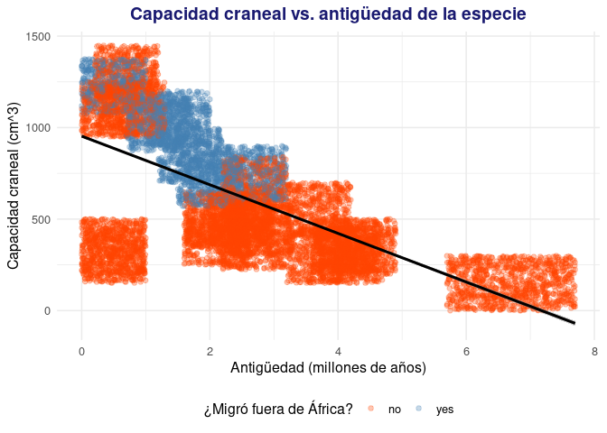
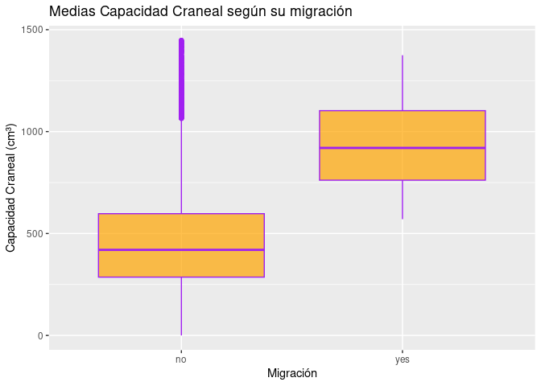

Análisis de Datos Biológicos de Ancestros Humanos

================
Manuel Jesus Méndez BautistaFrancisco Rafael Mesa TorresPedro Sánchez
MeléndezSergio Selma González
2025-12-10

# Introducción

El estudio de la <span style="color:#CC79A7">**evolución humana**</span>
busca entender cómo los <span style="color:">*ancestros humanos*</span>
(homínidos) han cambiado a lo largo del tiempo. Los registros fósiles
muestran variaciones en características biológicas como el tamaño del
cráneo (capacidad craneal), la estatura, la forma de la mandíbula y la
locomoción bípeda. Por ejemplo, se estima que *Homo sapiens* tiene una
capacidad craneal de alrededor de 1350 cm<sup>3</sup>, muy superior a la
de especies más antiguas como *Australopithecus africanus*. Además,
cambios climáticos (como niveles de CO<sub>2</sub> y expansiones de
sabanas) pudieron influir en la dispersión de los homínidos fuera de
África.

En este proyecto analizaremos un conjunto de datos biológicos de
homínidos[^1] para explorar tendencias evolutivas y realizar un análisis
estadístico. *¿Las especies más recientes tienen cerebros más grandes?*
*¿Qué factores pudieron influir en la migración fuera de África?* A
continuación, describimos los datos y presentamos los resultados de los
análisis realizados.

> “Este dataset se centra en homínidos consensuados.”

<figure>

<figcaption aria-hidden="true"><strong>Figura 1.</strong> Cronología de
algunas especies de homínidos estimada en millones de años. Cada barra
representa el rango de antigüedad de una especie perteneciente a
<em>Ardipithecus</em>, <em>Australopithecus</em> o
<em>Homo</em>.</figcaption>
</figure>

*Figura 1*: **Cronograma evolutivo** de distintos géneros de homínidos.
(Fuente: Conty, 2010, Wikimedia Commons, CC BY 3.0)

*Nota:* Este informe fue generado el 10 de December de 2025 mediante
código reproducible.

# Datos y Preparación

Para el análisis, se proporcionaron dos archivos CSV con información
biológica de distintas especies de homínidos: `Hominidos_DataSet.csv` y
`Evolution_DataSets.csv`.Vamos a comparar ambos datasets para ver cual
utilizamos

| Genus\_&\_Specie                        |      Time | Location |
|:----------------------------------------|----------:|:---------|
| hominino Orrorin tugenencin             | 6.0411237 | Africa   |
| hominino Ardipithecus ramidus / kabadda | 4.3839095 | Africa   |
| Australopithecus Afarensis              | 3.7494126 | Africa   |
| Australopithecus Anamensis              | 4.5956057 | Africa   |
| Australopithecus Africanus              | 3.6140595 | Africa   |
| Homo Rodhesiensis                       | 0.6794475 | Africa   |
| Australopithecus Afarensis              | 3.7889775 | Africa   |
| hominino Sahelanthropus tchadensis      | 7.5519668 | Africa   |
| Homo Neanderthalensis                   | 0.5473259 | Europa   |
| Australopithecus Anamensis              | 4.1809143 | Africa   |

Tabla 1. Diez primeras filas Evolution_DataSets.csv

| Genus\_&\_Specie | Time | Location |
|-----------------:|-----:|---------:|
|               16 |   11 |        0 |
|               22 |   21 |        0 |
|               21 |   18 |        0 |
|               17 |   17 |        0 |
|               15 |   22 |        0 |
|                8 |    2 |        0 |
|                5 |    3 |        0 |
|               16 |   11 |        0 |
|               22 |   21 |        0 |
|               18 |   10 |        0 |

Tabla 2. Diez primeras filas Hominidos_DataSet.csv

Ambos contienen datos similares, aunque el primero codifica categorías
con números y el segundo incluye etiquetas descriptivas. En este trabajo
utilizaremos principalmente `Evolution_DataSets.csv` por su legibilidad.

Como resultado, `evolution` contiene 12000 filas (observaciones) y 28
columnas (variables). Cada fila corresponde a una observación de una
especie de homínido en un momento y contexto determinados (se han
generado múltiples instancias por especie a partir de estimaciones). A
continuación se listan algunas de las **variables de interés**
incluidas:

- **Genus\_&Specie**: Nombre del género y especie (e.g., *Homo sapiens*,
  *Australopithecus afarensis*).
- **Time**: Antigüedad en millones de años (Ma) de la especie.
- **Cranial_Capacity**: Capacidad craneal en centímetros cúbicos
  (cm<sup>3</sup>), indicador del tamaño del cerebro.
- **Height**: Estatura estimada en centímetros.
- **Habitat**: Hábitat típico (bosque, sabana, etc.).
- **Diet**: Dieta predominante (frutas, omnívora, etc.).
- **Migrated**: Indica si hay evidencia de migración fuera de África
  (valores `"yes"` o `"no"`).

Por ejemplo, la capacidad craneal promedio de todos los registros es
aproximadamente 616.8 cm<sup>3</sup>. También observamos que las
especies más recientes (menor valor de **Time**) tienden a tener mayor
capacidad craneal y *Homo sapiens* es la única especie actual.
Seguidamente, realizaremos algunas visualizaciones para explorar estas
tendencias.

# Visualización de Datos

Para explorar la relación entre la antigüedad de la especie y el tamaño
del cráneo, se graficó **Time** (millones de años) frente a
**Cranial_Capacity** (cm<sup>3</sup>) para todas las observaciones. Se
distingue además si la especie **migró** fuera de África o no:

Primero vamos a ver las variables que vamos a seleccionar
representadolas en una tabla

    ## # A tibble: 12,000 × 2
    ##     Time Cranial_Capacity
    ##    <dbl>            <dbl>
    ##  1 6.04              145.
    ##  2 4.38              294.
    ##  3 3.75              265.
    ##  4 4.60              403.
    ##  5 3.61              679.
    ##  6 0.679            1155.
    ##  7 3.79              305.
    ##  8 7.55              258.
    ##  9 0.547            1156.
    ## 10 4.18              460.
    ## # ℹ 11,990 more rows

Aquí vemos las varables que buscamos relacionar y de esa manera
confirmar nuestra hipoteis

<figure>

<figcaption aria-hidden="true">Relación entre antigüedad y capacidad
craneal de homínidos. Cada punto representa una observación; se indica
en color si la especie migró fuera de África.</figcaption>
</figure>

*Figura 2*: Diagrama de dispersión de la antigüedad vs capacidad
craneal. Se observa una tendencia negativa: especies más recientes (más
a la izquierda en el eje *x*) tienden a poseer cráneos de mayor tamaño
(eje *y* más alto). Además, los puntos azules (especies migrantes) se
concentran hacia tiempos más recientes y capacidades craneales mayores,
mientras que los anaranjados (no migrantes) corresponden principalmente
a especies más antiguas y de menor capacidad craneal.

# Análisis Estadístico

A partir de las observaciones anteriores, planteamos la siguiente
**hipótesis**:

- *Hipótesis nula (H0)*: Las especies que migraron fuera de África no
  difieren en su capacidad craneal promedio de las especies que no
  migraron.
- *Hipótesis alternativa (H1)*: Las especies que migraron fuera de
  África tienen una capacidad craneal promedio distinta (mayor) a la de
  las especies que no migraron.

Vamos a previsualizar los datos que vamos a usar para nuestro analisis

| Cranial_Capacity | Migrated |
|-----------------:|:---------|
|         144.5141 | no       |
|         293.9602 | no       |
|         264.7985 | no       |
|         403.2805 | no       |
|         679.1523 | no       |
|        1155.2812 | no       |
|         305.3137 | no       |
|         258.0482 | no       |
|        1156.0802 | no       |
|         460.0607 | no       |

Tabla 3. Filtrado de los datos usados en este analisi

Antes de probar esta hipótesis, describimos las variables involucradas:
**Migrated** es una variable categórica binaria (“yes”/“no”) y
**Cranial_Capacity** es una variable numérica continua (medida en
cm<sup>3</sup>). Dado que comparamos las medias de dos grupos
independientes, emplearemos una prueba *t* de Student para dos muestras
independientes. Esta prueba asume que los datos (capacidad craneal) en
cada grupo se distribuyen aproximadamente de forma normal; considerando
el tamaño de muestra grande en cada grupo, la aproximación es razonable
(teorema del límite central).

A continuación, calculamos las medias muestrales de capacidad craneal
por grupo de migración y aplicamos la prueba *t*:

| Migrated |    N |  Media |   Desv |
|:---------|-----:|-------:|-------:|
| no       | 9000 | 511.03 | 332.42 |
| yes      | 3000 | 934.21 | 204.74 |

Capacidad craneal media (cm^3) por grupo de migración

Hemos hecho esto para generar la tabla

``` default
r knitr::kable(mean_by_group, digits = 2, caption = "Capacidad craneal media (cm^3) por grupo de migraci\u00f3n")
```

Como se ve en la tabla anterior, la media de capacidad craneal de los
homínidos **migrantes** es mayor que la de los **no migrantes**. Podemos
verlo también en esta figura

<!-- -->

Para hacer ese grafico hemos hecho:

``` default
r 
ggplot(evolution, aes(x = Migrated, y = Cranial_Capacity)) +
  geom_boxplot(fill = "orange", color = "purple", alpha = 0.7) + #Estamos usando el boxplot con intención de comparar las medias
  labs(
    title = "Medias Capacidad Craneal según su migración",
    x = "Migración",
    y = "Capacidad Craneal (cm³)"
  )
```

Ahora realizamos la prueba estadística:

    ## 
    ##  Welch Two Sample t-test
    ## 
    ## data:  Cranial_Capacity by Migrated
    ## t = -82.596, df = 8418.7, p-value < 2.2e-16
    ## alternative hypothesis: true difference in means between group no and group yes is not equal to 0
    ## 95 percent confidence interval:
    ##  -433.2284 -413.1415
    ## sample estimates:
    ##  mean in group no mean in group yes 
    ##          511.0281          934.2130

El resultado de la prueba *t* indica un **p-valor** muy pequeño (p \<
0.001). Con un nivel de significación α = 0.05, rechazamos la hipótesis
nula. En otras palabras, existe evidencia estadística de que la
capacidad craneal promedio difiere entre homínidos migrantes y no
migrantes. De hecho, la media de los migrantes es significativamente
mayor, lo que sugiere que los homínidos con cerebros más grandes
tuvieron mayor probabilidad de dispersarse fuera de África.

Adicionalmente, como *análisis extra*, ajustamos un **modelo de
regresión logística** para explorar la relación entre la capacidad
craneal y la probabilidad de migrar. Este modelo estadístico nos permite
cuantificar la influencia de una variable continua en una variable
binaria (*Migrated*). La fórmula del modelo es:

$$ \text{logit}(P(\text{Migrated} = \text{"yes"})) = \beta_0 + \beta_1 \cdot \text{Cranial_Capacity}. $$

Entrenamos el modelo con los datos y obtenemos el resumen de resultados:

    ## 
    ## Call:
    ## glm(formula = Migrated ~ Cranial_Capacity, family = binomial, 
    ##     data = evolution)
    ## 
    ## Coefficients:
    ##                    Estimate Std. Error z value Pr(>|z|)    
    ## (Intercept)      -3.769e+00  6.467e-02  -58.28   <2e-16 ***
    ## Cranial_Capacity  3.728e-03  7.527e-05   49.52   <2e-16 ***
    ## ---
    ## Signif. codes:  0 '***' 0.001 '**' 0.01 '*' 0.05 '.' 0.1 ' ' 1
    ## 
    ## (Dispersion parameter for binomial family taken to be 1)
    ## 
    ##     Null deviance: 13496  on 11999  degrees of freedom
    ## Residual deviance: 10233  on 11998  degrees of freedom
    ## AIC: 10237
    ## 
    ## Number of Fisher Scoring iterations: 5

Del modelo obtenido, observamos que el coeficiente asociado a
**Cranial_Capacity** es positivo y estadísticamente significativo (p \<
0.001). Esto implica que un mayor tamaño cerebral aumenta la
probabilidad de que la especie haya migrado fuera de África.

En resumen, nuestros análisis apoyan la idea de que a medida que los
homínidos evolucionaron (cerebros más grandes en promedio), también
adquirieron mayor movilidad geográfica. No obstante, es importante
señalar que la migración es un fenómeno multifactorial (tecnología,
clima, adaptación cultural, etc.), por lo que estos resultados deben
interpretarse con cautela dentro del contexto paleoantropológico.

# Conclusiones

- Existe una correlación negativa entre la antigüedad de la especie y su
  capacidad craneal: los homínidos más recientes tienen cráneos más
  voluminosos.
- Las especies de homínidos que migraron fuera de África presentan, en
  promedio, una capacidad craneal significativamente mayor que las que
  no migraron (p \< 0.001 en la prueba t).
- Un modelo de regresión logística sugiere que un mayor tamaño cerebral
  está asociado a una mayor probabilidad de migración, lo que concuerda
  con la idea de que características avanzadas pudieron favorecer la
  dispersión.
- En general, los resultados respaldan la hipótesis de que la evolución
  biológica (p.ej., aumento del cerebro) está vinculada a cambios en el
  comportamiento y la distribución geográfica de los ancestros humanos.

<!-- -->

    ## R version 4.5.2 (2025-10-31)
    ## Platform: x86_64-pc-linux-gnu
    ## Running under: Ubuntu 20.04.6 LTS
    ## 
    ## Matrix products: default
    ## BLAS:   /usr/lib/x86_64-linux-gnu/openblas-pthread/libblas.so.3 
    ## LAPACK: /usr/lib/x86_64-linux-gnu/openblas-pthread/liblapack.so.3;  LAPACK version 3.9.0
    ## 
    ## locale:
    ##  [1] LC_CTYPE=C.UTF-8       LC_NUMERIC=C           LC_TIME=C.UTF-8       
    ##  [4] LC_COLLATE=C.UTF-8     LC_MONETARY=C.UTF-8    LC_MESSAGES=C.UTF-8   
    ##  [7] LC_PAPER=C.UTF-8       LC_NAME=C              LC_ADDRESS=C          
    ## [10] LC_TELEPHONE=C         LC_MEASUREMENT=C.UTF-8 LC_IDENTIFICATION=C   
    ## 
    ## time zone: UTC
    ## tzcode source: system (glibc)
    ## 
    ## attached base packages:
    ## [1] stats     graphics  grDevices utils     datasets  methods   base     
    ## 
    ## other attached packages:
    ## [1] ggplot2_4.0.1 dplyr_1.1.4   readr_2.1.6  
    ## 
    ## loaded via a namespace (and not attached):
    ##  [1] Matrix_1.7-4       bit_4.6.0          gtable_0.3.6       compiler_4.5.2    
    ##  [5] crayon_1.5.3       tidyselect_1.2.1   parallel_4.5.2     splines_4.5.2     
    ##  [9] scales_1.4.0       yaml_2.3.11        fastmap_1.2.0      lattice_0.22-7    
    ## [13] R6_2.6.1           labeling_0.4.3     generics_0.1.4     knitr_1.50        
    ## [17] tibble_3.3.0       pillar_1.11.1      RColorBrewer_1.1-3 tzdb_0.5.0        
    ## [21] rlang_1.1.6        xfun_0.54          S7_0.2.1           bit64_4.6.0-1     
    ## [25] cli_3.6.5          withr_3.0.2        magrittr_2.0.4     mgcv_1.9-3        
    ## [29] digest_0.6.39      grid_4.5.2         vroom_1.6.7        rstudioapi_0.17.1 
    ## [33] hms_1.1.4          nlme_3.1-168       lifecycle_1.0.4    vctrs_0.6.5       
    ## [37] evaluate_1.0.5     glue_1.8.0         farver_2.1.2       rmarkdown_2.30    
    ## [41] tools_4.5.2        pkgconfig_2.0.3    htmltools_0.5.9

[^1]: Datos provenientes de Kaggle: *“Biological Data of Human Ancestors
    Data Sets”* (Santiago, 2022).
