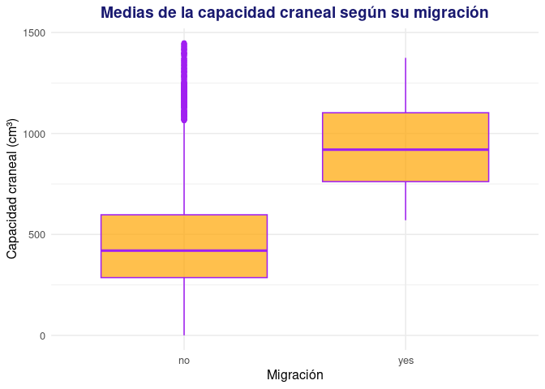
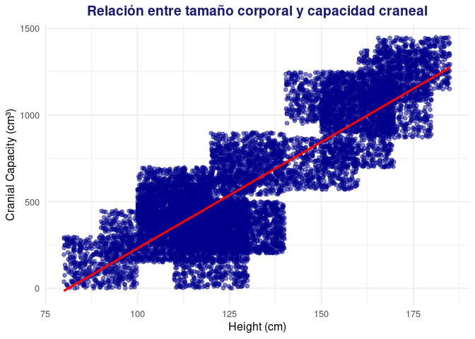
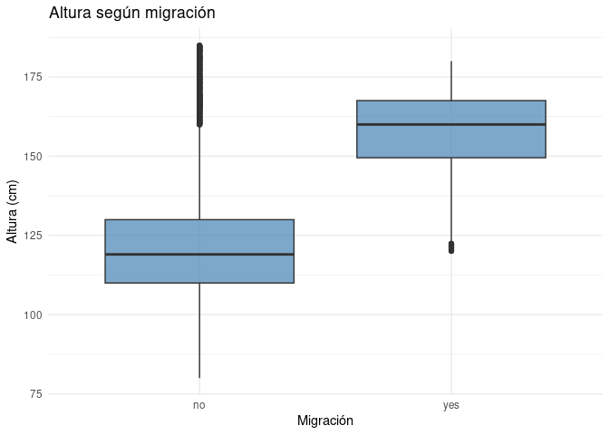
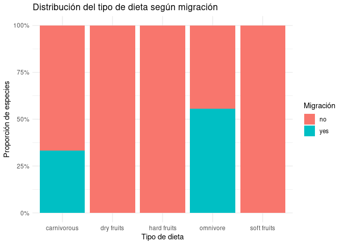

Análisis de Datos Biológicos de Ancestros Humanos

================
Manuel Jesus Méndez BautistaFrancisco Rafael Mesa TorresPedro Sánchez
MeléndezSergio Selma González
2025-12-16

*Nota: Este informe fue generado el 16 de December de 2025 mediante
código reproducible.*

# Introducción

El estudio de la <span style="color:#CC79A7">**evolución humana**</span>
busca entender cómo los <span style="color:#6A5ACD">*ancestros
humanos*</span> (homínidos) han cambiado a lo largo del tiempo. Los
registros fósiles muestran variaciones en características biológicas
como el tamaño del cráneo (capacidad craneal), la estatura, la forma de
la mandíbula y la locomoción bípeda. Por ejemplo, se estima que *Homo
sapiens* tiene una capacidad craneal de alrededor de 1350
cm<sup>3</sup>, muy superior a la de especies más antiguas como
*Australopithecus africanus*. Además, cambios climáticos (como niveles
de CO<sub>2</sub> y expansiones de sabanas) pudieron influir en la
dispersión de los homínidos fuera de África.

**En este proyecto analizamos** un conjunto de datos biológicos de
homínidos[^1] con el objetivo de explorar tendencias evolutivas y
realizar un análisis estadístico.

> “Este dataset se centra en homínidos consensuados.”


*Figura 1:* *Cronograma evolutivo* *de distintos géneros de homínidos.
(Fuente: Conty, 2010, Wikimedia Commons, CC BY 3.0)*

# Preparación de datos

Los **datos utilizados en este trabajo provienen del conjunto Biological
Data Of Human Evolution Data Sets** disponible en Kaggle
([santiago123678 2023](#ref-evolution_kaggle)).

Para visualizar los datos en nuestro trabajo, utilizaremos ([R Core Team
2022](#ref-R-base)), ([Xie 2023](#ref-R-knitr)) y ([Wickham et al.
2023](#ref-R-dplyr)). En lo que respecta a la creación de gráficas,
haremos uso de ([Wickham et al. 2025](#ref-R-ggplot2)).

Para el análisis, se proporcionaron dos archivos CSV con información
biológica de distintas especies de homínidos: `Hominidos_DataSet.csv` y
`Evolution_DataSets.csv`. Ambos contienen información similar, aunque
presentan diferencias relevantes: el dataset
`Hominidos_DataSet.csv`([Santiago 2022](#ref-kaggle_hominidos)) codifica
categorías mediante valores numéricos; por otro lado,
`Evolution_DataSets.csv`([santiago123678 2023](#ref-evolution_kaggle))
incluye etiquetas descriptivas. **En este trabajo utilizaremos**
principalmente `Evolution_DataSets.csv` por su legibilidad, gracias a la
facilidad que aporta para la interpretación directa de las variables.

A continuación, se muestra una previsualización de la tabla objeto de
estudio:

|            Genus\_&\_Specie             |   Time    | Location |
|:---------------------------------------:|:---------:|:--------:|
|       hominino Orrorin tugenencin       | 6.0411237 |  Africa  |
| hominino Ardipithecus ramidus / kabadda | 4.3839095 |  Africa  |
|       Australopithecus Afarensis        | 3.7494126 |  Africa  |
|       Australopithecus Anamensis        | 4.5956057 |  Africa  |
|       Australopithecus Africanus        | 3.6140595 |  Africa  |
|            Homo Rodhesiensis            | 0.6794475 |  Africa  |
|       Australopithecus Afarensis        | 3.7889775 |  Africa  |
|   hominino Sahelanthropus tchadensis    | 7.5519668 |  Africa  |
|          Homo Neanderthalensis          | 0.5473259 |  Europa  |
|       Australopithecus Anamensis        | 4.1809143 |  Africa  |

Tabla 1. Previsualización de datos de Evolution_DataSets.csv

Como resultado, `evolution` contiene **12000 filas (observaciones)** y
**28 columnas (variables)**. Cada **fila** corresponde a una observación
de una especie de homínido en un momento y contexto determinados;
algunas de las **variables de interés** incluidas son:

- **Genus\_&Specie**: Nombre del género y especie (e.g., *Homo sapiens*,
  *Australopithecus afarensis*).
- **Time**: Antigüedad en millones de años de la especie.
- **Cranial_Capacity**: Capacidad craneal en centímetros cúbicos (cm³),
  indicador del tamaño del cerebro.
- **Height**: Estatura estimada en centímetros.
- **Habitat**: Tipo de hábitat predominante (bosque, sabana, etc.).
- **Diet**: Dieta predominante (frugívora, omnívora, etc.).
- **Migrated**: Indica si hay evidencia de migración fuera de África
  (valores `"yes"` o `"no"`).

Como ejemplo descriptivo inicial, la capacidad craneal promedio de todos
los registros es aproximadamente 616.8 cm³. Asimismo, observamos que las
especies más recientes (menor valor de Time) tienden a presentar
capacidades craneales mayores, y *Homo sapiens* es la única especie
actual incluida en el dataset.

# Visualización y Análisis de datos

## Estaditica descriptiva

Para realizar un analisis estadistico fiable, tenemos que tener en
cuenta la naturaleza de los datos analizados, por ello, debemos asumir
que los datos siguen una distribución normal, no existe colinealidad
entre las variables independietes, hay homogeneidad de varianza y las
muestras son independientes. Estas asunciones con base en el gran
volumen de datos de los que disponemos

## Relación entre migración y tamaño craneal

Como objetivo principal de nuestro trabajo, encontramos comparar las
diferentes capacidades craneales que presentan tanto las especies que
han sufrido un proceso de migración desde el continente africano como
las que no. Para ello, haremos uso de varias hipótesis propuestas con el
fin de estudiar si aquellos homínidos que migraron, con todo lo que esta
migración conlleva, vieron como fruto un aumento en la capacidad
craneal.

Primero, para explorar la relación entre la migración de la especie y el
tamaño del cráneo, planteamos la siguiente **hipótesis Primaria**:

- **Hipótesis nula (H0)**: Las especies que migraron fuera de África no
  difieren en su capacidad craneal promedio de las especies que no
  migraron.

- **Hipótesis alternativa (H1)**: Las especies que migraron fuera de
  África tienen una capacidad craneal promedio distinta (mayor) a la de
  las especies que no migraron.

Vamos a previsualizar a utilizar en nuestro análisis:

| Cranial_Capacity | Migrated |
|:----------------:|:--------:|
|     144.5141     |    no    |
|     293.9602     |    no    |
|     264.7985     |    no    |
|     403.2805     |    no    |
|     679.1523     |    no    |
|    1155.2812     |    no    |
|     305.3137     |    no    |
|     258.0482     |    no    |
|    1156.0802     |    no    |
|     460.0607     |    no    |

Tabla 2. Previsualización de datos de capacidad craneal frente a
migración

Antes de probar esta hipótesis, describimos las variables involucradas:
**Migrated** es una variable categórica binaria (“yes”/“no”) y
**Cranial_Capacity** es una variable numérica continua (medida en cm³).
Dado que comparamos las medias de dos grupos independientes, emplearemos
una prueba t de Student para dos muestras independientes.

A continuación, calculamos las medias muestrales de capacidad craneal
por grupo de migración y aplicamos la prueba t:

| Migrated |    N |  Media |   Desv |
|:---------|-----:|-------:|-------:|
| no       | 9000 | 511.03 | 332.42 |
| yes      | 3000 | 934.21 | 204.74 |

Tabla 3. Estadísticos descriptivos de capacidad craneal según migración

Hemos utilizado el siguiente chunk para generar la tabla:

``` default
r mean_by_group <- evolution %>%
  group_by(Migrated) %>%
  summarize(N = n(),
            Media = mean(Cranial_Capacity, na.rm=TRUE),
            Desv = sd(Cranial_Capacity, na.rm=TRUE))
knitr::kable(mean_by_group, digits = 2, 
             caption = "Capacidad craneal media (cm³) por grupo de migración")
```

Como se vislumbra en la tabla anterior, la media de capacidad craneal de
los homínidos **migrantes** es mayor que la de los **no migrantes**.
Podemos observarlo también en esta figura:



*Figura 2: Medias de la capacidad craneal según la migración fuera de
África. El diagrama de cajas muestra diferencias claras en la capacidad
craneal en función de si las especies migraron o no fuera de África. Las
especies migrantes presentan, en términos generales, valores medios y
medianos de capacidad craneal más elevados, así como una mayor
concentración en rangos altos, mientras que las especies no migrantes
muestran capacidades craneales sensiblemente inferiores y una mayor
dispersión hacia valores bajos.*

Para elaborar este gráfico hemos realizado lo siguiente:

``` default
r 
ggplot(evolution, aes(x = Migrated, y = Cranial_Capacity)) +
  geom_boxplot(fill = "orange", color = "purple", alpha = 0.7) + #Estamos usando el boxplot con intención de comparar las medias
  labs(
    title = "Medias Capacidad Craneal según su migración",
    x = "Migración",
    y = "Capacidad Craneal (cm³)"
  )
```

Ahora, realizamos la prueba estadística:

    ## 
    ##  Welch Two Sample t-test
    ## 
    ## data:  Cranial_Capacity by Migrated
    ## t = -82.596, df = 8418.7, p-value < 2.2e-16
    ## alternative hypothesis: true difference in means between group no and group yes is not equal to 0
    ## 95 percent confidence interval:
    ##  -433.2284 -413.1415
    ## sample estimates:
    ##  mean in group no mean in group yes 
    ##          511.0281          934.2130

El resultado de la prueba t indica un **p-valor** muy pequeño (p \<
0.001). Con un nivel de significación α = 0.05, **rechazamos la
hipótesis nula**. En otras palabras, existe evidencia estadística de que
la capacidad craneal promedio difiere entre homínidos migrantes y no
migrantes. De hecho, la media de los migrantes es significativamente
mayor, lo que sugiere que los homínidos con cerebros más grandes
tuvieron mayor probabilidad de dispersarse fuera de África.

## Relación entre altura y migración

Con el fin de profundizar en nuestra hipótesis que relaciona capacidad
craneal y migración, dado que correlación entre variables no implica
causalidad entre estas, vemos pertinente respaldarla con dos hipótesis
secundarias.

En la primera de estas hipótesis, el procedimiento consistirá en
responder a la pregunta de si la altura en efecto está relacionada
positivamente con la migración, ya que un aumento de la altura conlleva
a un aumento de la capacidad. Pero en primer lugar, necesitamos
comprobar que exista esa relación positiva entre altura y capacidad
craneal.

Se plantea la siguiente **hipótesis terciaria**:

- **Hipótesis nula (H0)**: No existe relación entre capacidad craneal y
  tamaño corporal en las especies que migraron fuera de África.
- **Hipótesis alternativa (H1)**: Existe una relación significativa
  entre capacidad craneal y tamaño corporal en las especies migrantes.

Primero, volvemos a hacer una previsualización de los datos que nos
interesan:

|  Height   | Cranial_Capacity |
|:---------:|:----------------:|
| 110.24323 |     144.5141     |
| 107.69018 |     293.9602     |
| 123.76644 |     264.7985     |
| 111.40831 |     403.2805     |
| 111.59004 |     679.1523     |
| 144.77589 |    1155.2812     |
| 138.47796 |     305.3137     |
| 91.23118  |     258.0482     |
| 158.10385 |    1156.0802     |
| 117.35674 |     460.0607     |

Tabla 4. Previsualización de datos de capacidad craneal frente a altura

Procedemos a trabajar con los datos de altura:

|     N | Media_Height | SD_Height | Media_Cranial | SD_Cranial |
|------:|-------------:|----------:|--------------:|-----------:|
| 12000 |       131.45 |     24.54 |        616.82 |     356.28 |

Tabla 5. Estadísticos descriptivos de capacidad craneal según altura

A continuación, mostramos un gráfico simple de la relación:



*Figura 3: Diagrama de dispersión del tamaño corporal (altura) frente a
la capacidad craneal. Se observa una tendencia positiva: a mayor tamaño
corporal, mayor capacidad craneal. La línea de regresión muestra esta
relación creciente entre ambas variables, con una concentración de
observaciones en valores intermedios de altura y capacidad craneal.*

Por último, se realizó la prueba estadística mediante una **correlación
de Pearson**, ya que permite evaluar de forma adecuada la relación
lineal entre dos variables cuantitativas continuas, como las dos con las
que estamos trabajando.

    ## 
    ##  Pearson's product-moment correlation
    ## 
    ## data:  evolution$Height and evolution$Cranial_Capacity
    ## t = 173.75, df = 11998, p-value < 2.2e-16
    ## alternative hypothesis: true correlation is not equal to 0
    ## 95 percent confidence interval:
    ##  0.8407583 0.8509381
    ## sample estimates:
    ##       cor 
    ## 0.8459252

Los resultados obtenidos muestran que, en efecto, encontramos
correlación positiva entre altura y capacidad craneal. Es por eso, que
llegados a este punto, es adecuado comparar las variables de altura y
migración, ya que hemos visto que un aumento en la altura lleva consigo
un aumento en la capacidad craneal. Para ello, nos proponemos realizar
la hipótesis secundaria antes mencionada.

Se plantea la siguiente **hipótesis secundaria**:

- **Hipótesis nula (H0)**: No existe relación entre la altura y la
  migración de las especies de homínidos.
- **Hipótesis alternativa (H1)**: Existe una relación significativa
  entre la altura y la migración de las especies de homínidos.

Procedemos a seleccionar los datos a utilizar:

|  Height   | Migrated |
|:---------:|:--------:|
| 110.24323 |    no    |
| 107.69018 |    no    |
| 123.76644 |    no    |
| 111.40831 |    no    |
| 111.59004 |    no    |
| 144.77589 |    no    |
| 138.47796 |    no    |
| 91.23118  |    no    |
| 158.10385 |    no    |
| 117.35674 |    no    |

Tabla 5. Previsualización de datos de migración frente a altura

Una vez contamos con los datos con los que queremos trabajar en esta
hipótesis secundaria, procedemos a visualizarlos con el siguiente
gráfico:



*Figura 4: Gráfico Boxplot. Se muestra una tendencia a presentar mayor
altura en aquellas especies de homínidos que hayan migrado.*

Por último, realizamos el análisis estadístico adecuado que nos
permitirá ver si existe una correlación entre la altura y la migración:

    ## 
    ##  Welch Two Sample t-test
    ## 
    ## data:  Height by Migrated
    ## t = -95.588, df = 7298.8, p-value < 2.2e-16
    ## alternative hypothesis: true difference in means between group no and group yes is not equal to 0
    ## 95 percent confidence interval:
    ##  -34.27071 -32.89334
    ## sample estimates:
    ##  mean in group no mean in group yes 
    ##          123.0567          156.6387

Como podemos observar en los resultados, obtenemos un p-value
extremadamente bajo (p-value \< 2.2e-16), por lo que afirmamos la
existencia de la correlación, aunque insistimos en que no explica ni
determina una causalidad. Concluimos, entonces, que se refuerza la idea
previa de una relación entre capacidad craneal y migración.

## Relación entre dieta y migración

Los análisis previos nos mostraron que tanto la migración como el tamaño
corporal guardan relación con la capacidad craneal de las distintas
especies de homínidos del dataset, pero estos factores no actúan de
forma aislada en la evolución del cerebro humano. Entre los elementos
más influyentes en los procesos de encefalización se encuentra la dieta,
muy relacionada a migración y tamaño corporal, pues esta varía
dependiendo de la época y hábitat de los homínidos, esta dieta determina
la disponibilidad energética necesaria para desarrollar tejidos costosos
como el cerebro.

Es por eso oportuno usar la variable de dieta para hacer una segunda
hipótesis secundaria que vuelva a reforzar nuestra hipótesis principal
sobre la correlación entre la capacidad craneal y la migración. Para
ello, es necesario por lo tanto realizar una segunda hipótesis terciaria
que responda a la pregunta de si la dieta está primeramente relacionada
con la capacidad craneal.

Planteamos la siguiente **hipótesis terciaria**:

- **Hipótesis nula (H0)**: La capacidad craneal promedio no difiere
  entre los diferentes tipos de dieta presentes en el dataset
  (frugívora, omnívora, etc.).
- **Hipótesis alternativa (H1)**: La capacidad craneal promedio sí
  difiere entre los distintos tipos de dieta; es decir, la dieta está
  asociada a variaciones en la capacidad craneal.

Realizamos primero la visualización de los datos a utilizar:

|    Diet     | Cranial_Capacity |
|:-----------:|:----------------:|
| dry fruits  |     144.5141     |
| soft fruits |     293.9602     |
| dry fruits  |     264.7985     |
| dry fruits  |     403.2805     |
| dry fruits  |     679.1523     |
|  omnivore   |    1155.2812     |
| dry fruits  |     305.3137     |
| dry fruits  |     258.0482     |
| carnivorous |    1156.0802     |
| dry fruits  |     460.0607     |

Tabla 6. Previsualización de datos de capacidad craneal frente a dieta

Procedemos a trabajar con los datos de la dieta:

|    Diet     |  n   | Media_Cranial | SD_Cranial |
|:-----------:|:----:|:-------------:|:----------:|
| carnivorous | 1500 |    1211.99    |   120.40   |
| dry fruits  | 3000 |    307.74     |   162.84   |
| hard fruits | 2000 |    532.44     |   122.79   |
|  omnivore   | 4500 |    721.37     |   308.81   |
| soft fruits | 1000 |    349.62     |   99.38    |

Tabla 8. Estadísticos descriptivos de capacidad craneal según tipo de
dieta

Visualizamos los datos usando un gráfico adecuado:


*Figura 5: Diagrama de cajas de la capacidad craneal según el tipo de
dieta. Se observan diferencias en la distribución de la capacidad
craneal entre los distintos grupos dietéticos. Las especies con dieta
carnívora y omnívora presentan, en general, valores medianos más
elevados, mientras que las dietas basadas en frutos secos y frutos
blandos se asocian con capacidades craneales menores. La variabilidad
también difiere entre grupos, siendo especialmente amplia en el caso de
las especies omnívoras.*

Por último, hacémos un nuevo análisis estadístico que compare las
variables de altura y capacidad craneal.

    ##                Df    Sum Sq   Mean Sq F value Pr(>F)    
    ## Diet            4 952749637 238187409    5010 <2e-16 ***
    ## Residuals   11995 570312458     47546                   
    ## ---
    ## Signif. codes:  0 '***' 0.001 '**' 0.01 '*' 0.05 '.' 0.1 ' ' 1

Los análisis realizados indican que la dieta está asociada a diferencias
significativas en la capacidad craneal (ANOVA: p \< 0.05). Las
comparaciones post-hoc muestran que ciertas categorías dietéticas
presentan capacidades craneales notablemente diferentes, lo que sugiere
que los cambios alimentarios pudieron desempeñar un papel relevante en
el proceso de encefalización en homínidos.

Este resultado es coherente con hipótesis paleoantropológicas clásicas
que vinculan dietas más energéticas (incluyendo mayor acceso a carne o
alimentos procesados) con el aumento del tamaño cerebral en el linaje
humano. No obstante, la interpretación debe realizarse con cautela, ya
que la dieta interactúa con múltiples factores ecológicos, tecnológicos
y anatómicos.

Una vez confirmada la relación existente entre dieta y capacidad
craneal, resulta pertinente analizar cómo la migración afecta a la dieta
para reforzar nuestra hipótesis principal. Desde un enfoque estadístico,
esto nos permite comprobar si los procesos migratorios se asocian con
cambios significativos en el tipo de alimentación. En particular,
podemos evaluar si, como consecuencia de la migración, se observa una
mayor proporción de dietas energéticas en las poblaciones estudiadas.
Esta evidencia contribuiría a sostener que la migración no solo implica
desplazamiento geográfico, sino también adaptaciones alimentarias. En
conjunto, este análisis añade coherencia y solidez a la hipótesis
general del estudio.

Planteamos la siguiente **hipótesis secundaria**:

- **Hipótesis nula (H0)**: No existe ninguna correlación entre dieta y
  migración.
- **Hipótesis alternativa (H1)**: Existe una correlación entre la dieta
  y la migración.

Procedemos a visualizar los datos:



*Figura 6: Gráfico de distribución del tipo de dieta según la migración
de la especies de homínidos. Este gráfico muestra que aquellas especies
que presentan una dieta de alto valor energético (carnívora y omnívora)
cuentan con un mayor porcentaje de migración desde el continente
africano.*

    ##      
    ##       carnivorous dry fruits hard fruits omnivore soft fruits
    ##   no         1000       3000        2000     2000        1000
    ##   yes         500          0           0     2500           0

Realizamos un análisis estadístico adecuado:

    ## 
    ##  Pearson's Chi-squared test
    ## 
    ## data:  tabla_mig_diet
    ## X-squared = 4296.3, df = 4, p-value < 2.2e-16

Con los resultados obtenidos (p_value \< 2.2e-16), podemos concluir que
efectivaemente existe una correlación entre la dieta de los homínidos y
la migración de estos. Y habiendo determinado previamente que existe una
relación entre la dieta y la capacidad craneal, nos sirve para de nuevo
reforzar nuestra idea principal sobre conexión entre el aumento de la
capacidad craneal y la migración de las especies de homínidos.

# Conclusiones

- Las especies de homínidos que migraron fuera de África presentan, en
  promedio, una capacidad craneal significativamente mayor que las que
  no migraron (p \< 0.001 en la prueba t).
- El análisis sugiere una relación estadísticamente significativa entre
  el aumento del tamaño corporal y la migración en los homínidos. Este
  hallazgo indica que las diferencias en la capacidad craneal de las
  especies migrantes no solo reflejan la expansión cerebral, sino
  también transformaciones corporales asociadas a la migración desde
  África.
- Dietas más energéticas están relacionadas con una mayor capacidad
  craneal, y por lo tanto con una mayor migración, lo que sugiere y
  destaca la importancia del cambio de dieta en el desarrollo cerebral
  de los homínidos.
- En conclusión, la migración de los homínidos fuera de África se asocia
  de manera significativa con un aumento de la capacidad craneal,
  estrechamente relacionado tanto con el incremento del tamaño corporal
  como con la adopción de dietas más energéticas. Estos resultados
  indican que la expansión cerebral formó parte de un proceso adaptativo
  complejo, en el que los cambios corporales y nutricionales
  desempeñaron un papel clave para afrontar las nuevas condiciones
  ecológicas derivadas de la migración.

# Versión

    ## R version 4.5.2 (2025-10-31)
    ## Platform: x86_64-pc-linux-gnu
    ## Running under: Ubuntu 20.04.6 LTS
    ## 
    ## Matrix products: default
    ## BLAS:   /usr/lib/x86_64-linux-gnu/openblas-pthread/libblas.so.3 
    ## LAPACK: /usr/lib/x86_64-linux-gnu/openblas-pthread/liblapack.so.3;  LAPACK version 3.9.0
    ## 
    ## locale:
    ##  [1] LC_CTYPE=C.UTF-8       LC_NUMERIC=C           LC_TIME=C.UTF-8       
    ##  [4] LC_COLLATE=C.UTF-8     LC_MONETARY=C.UTF-8    LC_MESSAGES=C.UTF-8   
    ##  [7] LC_PAPER=C.UTF-8       LC_NAME=C              LC_ADDRESS=C          
    ## [10] LC_TELEPHONE=C         LC_MEASUREMENT=C.UTF-8 LC_IDENTIFICATION=C   
    ## 
    ## time zone: UTC
    ## tzcode source: system (glibc)
    ## 
    ## attached base packages:
    ## [1] stats     graphics  grDevices utils     datasets  methods   base     
    ## 
    ## other attached packages:
    ## [1] ggplot2_4.0.1 dplyr_1.1.4   readr_2.1.6  
    ## 
    ## loaded via a namespace (and not attached):
    ##  [1] Matrix_1.7-4       bit_4.6.0          gtable_0.3.6       compiler_4.5.2    
    ##  [5] crayon_1.5.3       tidyselect_1.2.1   parallel_4.5.2     splines_4.5.2     
    ##  [9] scales_1.4.0       yaml_2.3.11        fastmap_1.2.0      lattice_0.22-7    
    ## [13] R6_2.6.1           labeling_0.4.3     generics_0.1.4     knitr_1.50        
    ## [17] tibble_3.3.0       pillar_1.11.1      RColorBrewer_1.1-3 tzdb_0.5.0        
    ## [21] rlang_1.1.6        xfun_0.54          S7_0.2.1           bit64_4.6.0-1     
    ## [25] cli_3.6.5          withr_3.0.2        magrittr_2.0.4     mgcv_1.9-3        
    ## [29] digest_0.6.39      grid_4.5.2         vroom_1.6.7        rstudioapi_0.17.1 
    ## [33] hms_1.1.4          nlme_3.1-168       lifecycle_1.0.4    vctrs_0.6.5       
    ## [37] evaluate_1.0.5     glue_1.8.0         farver_2.1.2       rmarkdown_2.30    
    ## [41] tools_4.5.2        pkgconfig_2.0.3    htmltools_0.5.9

# 6 Bibliografía

<div id="refs" class="references csl-bib-body hanging-indent"
entry-spacing="0">

<div id="ref-R-base" class="csl-entry">

R Core Team. 2022. *R: A Language and Environment for Statistical
Computing*. Vienna, Austria: R Foundation for Statistical Computing.
<https://www.R-project.org/>.

</div>

<div id="ref-kaggle_hominidos" class="csl-entry">

Santiago. 2022. “Biological Data of Human Ancestors Data Sets.” Kaggle
Dataset.
<https://www.kaggle.com/datasets/santiago123678/biological-data-of-human-ancestors-data-sets/data>.

</div>

<div id="ref-evolution_kaggle" class="csl-entry">

santiago123678. 2023. “Biological Data of Human Evolution Data Sets.”
<https://www.kaggle.com/datasets/santiago123678/biological-data-of-human-ancestors-data-sets>.

</div>

<div id="ref-R-ggplot2" class="csl-entry">

Wickham, Hadley, Winston Chang, Lionel Henry, Thomas Lin Pedersen,
Kohske Takahashi, Claus Wilke, Kara Woo, Hiroaki Yutani, Dewey
Dunnington, and Teun van den Brand. 2025. *Ggplot2: Create Elegant Data
Visualisations Using the Grammar of Graphics*.
<https://ggplot2.tidyverse.org>.

</div>

<div id="ref-R-dplyr" class="csl-entry">

Wickham, Hadley, Romain François, Lionel Henry, Kirill Müller, and Davis
Vaughan. 2023. *Dplyr: A Grammar of Data Manipulation*.
<https://dplyr.tidyverse.org>.

</div>

<div id="ref-R-knitr" class="csl-entry">

Xie, Yihui. 2023. *Knitr: A General-Purpose Package for Dynamic Report
Generation in r*. <https://yihui.org/knitr/>.

</div>

</div>

[^1]: Datos provenientes de Kaggle: *“Biological Data of Human Ancestors
    Data Sets”* (Santiago, 2022).
